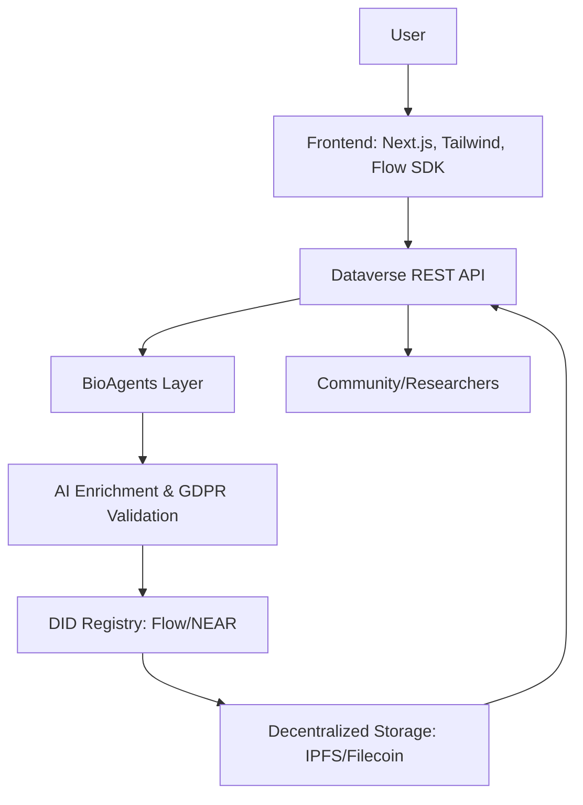

# DNA_ID

<p align="center">
  
</p>
---

## Objectives
- **A scalable, GDPR-compliant Decentralised Identifier (DID) system** as a sustainable, user-centric addition to existing persistent identifier infrastructures (DOI, Handle).
- **Integrate with Dataverse** and demonstrate through AI applications to showcase decentralised metadata management and user empowerment in cultural heritage data contexts.
- **Deliver a prototype DID system compatible with GDPR.**
- **Reduce costs** associated with massive identifier creation.
- **Enhance user control** over personal metadata.
- **Increase data accessibility and community engagement.**
- **Align with major priorities:** inclusivity, security, and sustainability.

---

## About Me
**Project Lead:** Neha Kumari 
[X](https://x.com/matriX_Nk) | [LinkedIn](https://linkedin.com/in/neha_kumari711) | [GitHub](https://github.com/Nkovaturient)

---

## Tech Integrations Highlights
- **W3C Decentralized Identifiers (DID)**
- **GDPR Compliance & Consent Management**
- **Dataverse Academic Repository Integration**
- **AI-powered Metadata Enrichment (LangChain, BioAgents)**
- **Decentralized Storage (IPFS/Filecoin, Powergate)**
- **Blockchain Support:** Flow, NEAR
- **Verifiable Credentials (VCs)**
- **Modern Frontend:** Next.js, Tailwind CSS, Redux Toolkit

---

## BIOAGENTS CUSTOM WORKFLOW BRIDGE

> **Automated pipeline for dataset onboarding, enrichment, compliance, and persistent identifier issuance:**

```mermaid
flowchart TD
    A[Harvest Metadata from Dataverse]
    B[AI Enrichment (BioAgents)]
    C[GDPR Compliance Check]
    D[Issue DID & Verifiable Credential]
    E[Publish to OriginTrail DKG (optional)]
    A --> B --> C --> D --> E
```

---

## Architectural Diagram & Flowchart



---

## Contribution Guide

1. **Fork the repository** and clone it locally.
2. **Create a new branch** for your feature or bugfix.
3. **Commit your changes** with clear messages.
4. **Push to your fork** and submit a Pull Request.
5. **Describe your changes** and reference any related issues.
6. **Participate in code review** and address feedback.

---

## Setting Up Locally

1. **Clone the repository:**
   ```bash
   git clone https://github.com/Nkovaturient/DNA_ID.git
   cd DNA_ID
   ```
2. **Install dependencies:**
   ```bash
   npm install
   ```
3. **Set up environment variables:**
   - Copy `.env.example` to `.env` and fill in required values (Dataverse API, blockchain endpoints, etc).

    `cp .env.example .env`

4. **Run the development server:**
  - Frontend(from current path)

   ```bash
   npm run dev
   ```
   - Backend -- open another terminal

   ```bash
   cd backend
   npm run dev
   ```

5. **Access the app:**
   - Access [frontend](http://localhost:5173) in your browser and
   - Open [server](http://localhost:3000) and verify its running.

---

## Further Enhancements
- Full integration of all UI flows with backend endpoints
- Advanced consent management and user notifications
- Multi-factor authentication and advanced security
- More granular metadata enrichment and explainability
- Accessibility and internationalization improvements
- Automated testing and CI/CD
- Community documentation and tutorials

---

## Potentiality of the Project
- **Transform persistent identifier infrastructure** for research, cultural heritage, and open science.
- **Empower users** with control over their digital identity and metadata.
- **Enable new AI-driven applications** for data discovery, enrichment, and compliance.
- **Foster inclusivity, transparency, and sustainability** in digital infrastructure.

---

## Resources
- [W3C DID Specification](https://www.w3.org/TR/did-core/)
- [Dataverse Project](https://dataverse.org/)
- [LangChain Documentation](https://js.langchain.com/docs/)
- [Filecoin/IPFS](https://filecoin.io/)
- [Flow Blockchain](https://www.onflow.org/)
- [NEAR Protocol](https://near.org/)
- [GDPR Official Site](https://gdpr.eu/)
- [OriginTrail DKG](https://origintrail.io/)

---

> _The cosmic sea of knowledge flows in our **DNA**, monitored and enhanced by **AI**, providing a decentralized, authenticated **ID**, hence the name - **DNA_ID**_

> Thank You![🧬 🤖 🆔 ]